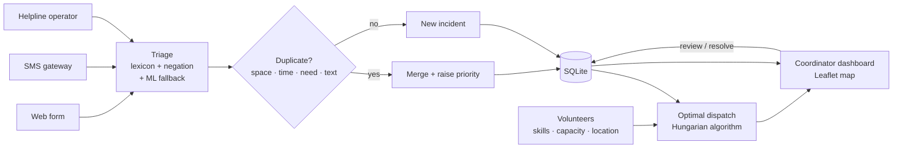

# ReliefLink

**AI-assisted coordination for disaster relief: triage help requests in English, Hindi and Tamil, merge duplicate reports, and dispatch volunteers optimally.**

   

---

## The problem

During the Chennai floods of 2015 and 2023, help requests poured in through WhatsApp forwards, SMS, helplines and social media. Volunteer coordinators faced three problems at once:

1. **No prioritization.** A family on a rooftop with water rising sat in the same queue as a request for blankets.
2. **Duplicate noise.** The same incident was reported by the family, their neighbours and relatives in other cities, so teams were sent twice while other people waited.
3. **Ad-hoc dispatch.** Volunteers were sent to whoever asked first, not to where their skills and location mattered most.

ReliefLink is a coordinator dashboard and API that tackles all three.

## What it does

| Capability | How |
|---|---|
| **Multilingual triage** | Reads free text in English, Hindi and Tamil (script and romanized). Detects the need (rescue, medical, water, food, shelter), estimates people affected, and scores urgency 0–100 with a **plain-language explanation** of every point |
| **Duplicate detection** | Merges reports of the same incident using spatial distance, a time window, need overlap and cross-script character n-gram similarity. Corroborating reports raise priority |
| **Optimal dispatch** | Assigns volunteers to requests by solving an assignment problem (Hungarian algorithm) over urgency, distance, skills and capacity |
| **Human-in-the-loop** | Messages the system doesn't confidently understand are flagged **REVIEW** and never silently ranked LOW. Coordinators confirm or correct them in one click |
| **Starvation prevention** | Waiting requests slowly gain priority, so low-urgency needs are never ignored forever |
| **SMS intake** | `HELP trapped on roof, 3 kids @13.04,80.25` works over a basic-phone SMS gateway, with no app or internet required |
| **Live map dashboard** | Requests colored by priority, volunteer positions, dispatch routes with ETAs, and a live triage preview as you type |

## Results

Full report: [`eval/RESULTS.md`](eval/RESULTS.md) (regenerate with `python -m eval.evaluate`).

### Dispatch: optimal vs first-come-first-served

200 simulated flood scenarios across Chennai (40 requests, 14 volunteers each):

| Metric | Optimal | First-come | Change |
|---|---|---|---|
| **Critical requests served** | **84.3%** | 54.5% | **+29.8 pts** |
| Total urgency served | 1158 | 984 | +17.7% |
| Travel per assignment | 6.27 km | 7.35 km | −14.7% |
| Average ETA | 25.1 min | 29.4 min | −14.6% |

### Triage

| Metric | Held-out set (32 messages, never used for tuning) |
|---|---|
| Need category accuracy | **91%** |
| Urgency within one level | 84% |
| Critical messages ranked HIGH or CRITICAL | 71% (10/14) |
| Critical messages ranked LOW | **0** |

### How the evaluation shaped the design

The first evaluation showed that only **41%** of critical messages were ranked HIGH or above. The scoring was too conservative, which is the dangerous kind of error in a disaster. Three changes followed:

1. **A safety floor.** Any explicit threat to life ("unconscious", "water up to our chest", "swept away") guarantees at least HIGH. Under-triage can cost a life; over-triage costs minutes.
2. **An ML fallback.** A character and word n-gram logistic regression, trained only on the development set, handles phrasing the lexicon has never seen. This raised held-out category accuracy from 75% to 91%.
3. **A review queue.** Anything neither component recognizes is flagged for a human at MEDIUM or above, instead of sinking to LOW.

To avoid fooling myself, I then wrote a **separate held-out set** and labeled it *before* running it. It was never used for tuning, and the classifier's regularization was chosen by cross-validation on the development set only. The held-out numbers above are lower than the development numbers, which is exactly why they're worth reporting.

## Architecture



### Triage (`app/triage.py`, `app/classifier.py`)

- **Weighted lexicons** in English, Hindi and Tamil for needs, life-threat cues and vulnerable groups (children, elderly, pregnant, bedridden, chronic patients).
- **Negation handling** that respects word order in each language: English negators come *before* the phrase ("no one is injured"), Hindi and Tamil negators *after* it ("घायल नहीं", "காயம் இல்லை"). Resource words are deliberately exempt, because "no food" means the person *needs* food.
- **Pattern-based flood detection** ("water is rising", "water up to our chest") with depth-aware severity.
- **People estimation** from numbers, number words, "family of five", and group settings like relief camps.
- **Explainability**: every result lists its evidence, e.g. `life-threat cues: "water rising" · vulnerable: elderly, children · 6 people affected`.
- **Optional semantic layer** (`USE_EMBEDDINGS=1`): multilingual sentence embeddings compared against category prototypes. This mode is implemented but **not yet evaluated**; see limitations.

### Duplicate detection (`app/dedup.py`)

Two reports are the same incident if they are within 500 m and 12 hours, share a need, and are textually similar (character n-gram TF-IDF, which works across scripts and typos), or are almost exactly co-located. A merge re-triages the combined text, since a second report often adds details like "there's a baby here".

### Dispatch (`app/matching.py`)

Each volunteer contributes one "slot" per unit of capacity. For every slot–request pair:

```
cost = −urgency + 4 × distance_km        (infeasible if wrong skill or > 15 km)
```

`scipy.optimize.linear_sum_assignment` finds the minimum-cost assignment exactly. The weight means 1 km of travel is worth 4 urgency points: a medic 2 km away from a critical patient beats one 0.5 km away from a mild case.

## Quick start

```bash
git clone <this repo> && cd relieflink
python -m venv venv && source venv/bin/activate     # Windows: venv\Scripts\activate
pip install -r requirements.txt
uvicorn app.main:app --reload
```

1. Open **http://127.0.0.1:8000**
2. Click **Load demo scenario** to load 24 messages (including Hindi, Tamil and duplicates) and 10 volunteers across Chennai
3. Click **Dispatch volunteers** to see assignment routes appear on the map
4. Type a message in the **New help request** box to watch the live triage, then click the map to place it

Interactive API docs: http://127.0.0.1:8000/docs

```bash
pytest -q                     # 34 tests
python -m eval.evaluate       # regenerate eval/RESULTS.md
docker build -t relieflink . && docker run -p 8000:8000 relieflink
```

## API

| Method | Endpoint | Purpose |
|---|---|---|
| POST | `/api/requests` | Submit a help request (triaged and de-duplicated) |
| POST | `/api/sms` | SMS gateway webhook, returns the reply text |
| POST | `/api/triage` | Score a message without saving it |
| GET | `/api/requests` | All requests, highest priority first |
| POST | `/api/requests/{id}/review` | Coordinator confirms or corrects triage |
| POST | `/api/requests/{id}/resolve` | Close a request and free its volunteers |
| POST / GET | `/api/volunteers` | Register or list volunteers |
| POST | `/api/dispatch?strategy=optimal` | Assign volunteers (`dry_run=true` to preview) |
| GET | `/api/dispatch/compare` | Optimal vs first-come metrics on current data |
| GET | `/api/stats` | Dashboard counters |

## Project structure

```
app/
  triage.py        multilingual lexicon triage, negation, urgency scoring, explanations
  classifier.py    n-gram logistic-regression fallback (trained on the development set)
  dedup.py         duplicate-incident detection
  matching.py      Hungarian-algorithm dispatch + first-come baseline + metrics
  geo.py           haversine distance, ETA
  db.py            SQLite schema and helpers
  main.py          FastAPI routes
static/index.html  coordinator dashboard (Leaflet, vanilla JS)
data/
  seed.py              Chennai flood demo scenario
  triage_training.csv  development set (tuning + classifier training)
eval/
  heldout_messages.csv held-out test set (never used for tuning)
  evaluate.py          triage metrics + 200-scenario dispatch simulation
  RESULTS.md           generated report
tests/             34 pytest tests (triage, dedup, matching, API)
```

## Limitations (and what I'd do next)

- **No real disaster data.** Both evaluation sets were written by me. The most valuable next step is evaluating on real, anonymized messages from a past flood, with labels from actual relief coordinators.
- **Held-out safety recall is 71%.** Four critical messages were ranked MEDIUM, though none were ranked LOW. More diverse training data and the embedding layer are the obvious next experiments.
- **The embedding layer is unevaluated.** It's implemented but wasn't measured, because the development environment couldn't download the model.
- **Simulated dispatch.** The dispatch gains come from synthetic scenarios with straight-line distances. Real deployments need road-network routing, with flooded roads removed.
- **Single-node.** SQLite and in-process state are fine for a district control room. Scaling city-wide would mean Postgres/PostGIS and a message queue.
- **Privacy.** Real deployments must protect phone numbers and locations: access control, retention limits and audit logs.

## Tech stack

Python · FastAPI · Pydantic · SQLite · scikit-learn · SciPy · NumPy · Leaflet.js · pytest · Docker

## License

MIT
